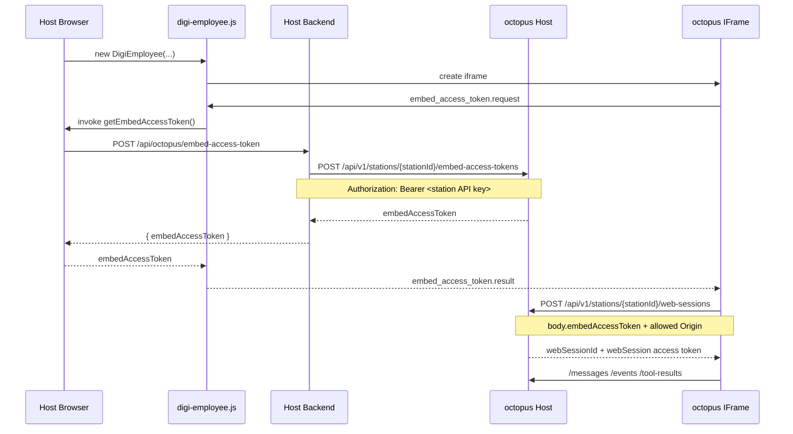

# octopus Embed Examples

This repository contains minimal examples for embedding an octopus `web-application` station into a SaaS product or a custom web application.

## Production Endpoints

- Loader script: `https://embed.autostaff.cn/sdk/digi-employee.js`
- IFrame app: `https://embed.autostaff.cn/embed/stations/:stationId`
- Host API: `https://api.autostaff.cn`

## Integration Contract

The host application is responsible for:

1. Rendering a mount container for the Botworks panel.
2. Calling its own backend to fetch a short-lived `embedAccessToken`.
3. Passing browser-side UI tools through `extendsUiTools`.

The host backend is responsible for:

1. Verifying the current SaaS user and business object.
2. Calling octopus Host with the station server API key.
3. Receiving an octopus-issued short-lived `embedAccessToken`.
3. Returning JSON in the shape:

```json
{
  "embedAccessToken": "eat_xxx"
}
```

## Credential Model

There are three different credentials in the flow:

1. `station API key`
   Used only by the host backend when it calls octopus Host.
2. `embedAccessToken`
   Issued by octopus Host and returned to the browser for `CreateWebSession`.
3. `webSession access token`
   Issued by octopus Host after `CreateWebSession`; used by the iframe for `messages`, `events`, and `tool-results`.

## End-to-End Sequence



## Examples

- [plain-html](./examples/plain-html): static HTML integration with a textarea-based mock document.
- [react](./examples/react): React + Vite example that loads the public loader script at runtime.
- [vue](./examples/vue): Vue + Vite example that loads the public loader script at runtime.

## Expected Environment Variables

The React and Vue examples read:

- `VITE_STATION_ID`
- `VITE_EXTERNAL_CONVERSATION_ID`
- `VITE_EMBED_TOKEN_URL`

`VITE_EMBED_TOKEN_URL` should point to your own backend endpoint that returns:

```json
{
  "embedAccessToken": "eat_xxx"
}
```

## Host Backend Pseudocode

```ts
app.post('/api/octopus/embed-access-token', async (req, res) => {
  const user = await requireAuthenticatedUser(req)
  const stationId = process.env.BOTWORKS_STATION_ID
  const externalConversationId = req.body.externalConversationId

  const issueResp = await fetch(
    `https://api.autostaff.cn/api/v1/stations/${stationId}/embed-access-tokens`,
    {
      method: 'POST',
      headers: {
        Authorization: `Bearer ${process.env.OCTOPUS_STATION_API_KEY}`,
        'Content-Type': 'application/json',
      },
      body: JSON.stringify({
        externalConversationId,
        subject: `user:${user.id}`,
        ttlSeconds: 300,
      }),
    },
  )

  if (!issueResp.ok) {
    throw new Error(`failed to issue embed access token: ${issueResp.status}`)
  }

  const payload = await issueResp.json()

  res.json({
    embedAccessToken: payload.embedAccessToken,
  })
})
```

## Notes

- These examples intentionally use the public loader script URL so the repository stays independent from octopus internal source layout.
- `extendsUiTools` are browser-session scoped and only available to the current embedded session.
- Layout support is expected to include `inline`, `sidebar`, `overlay`, and `fullscreen`.
